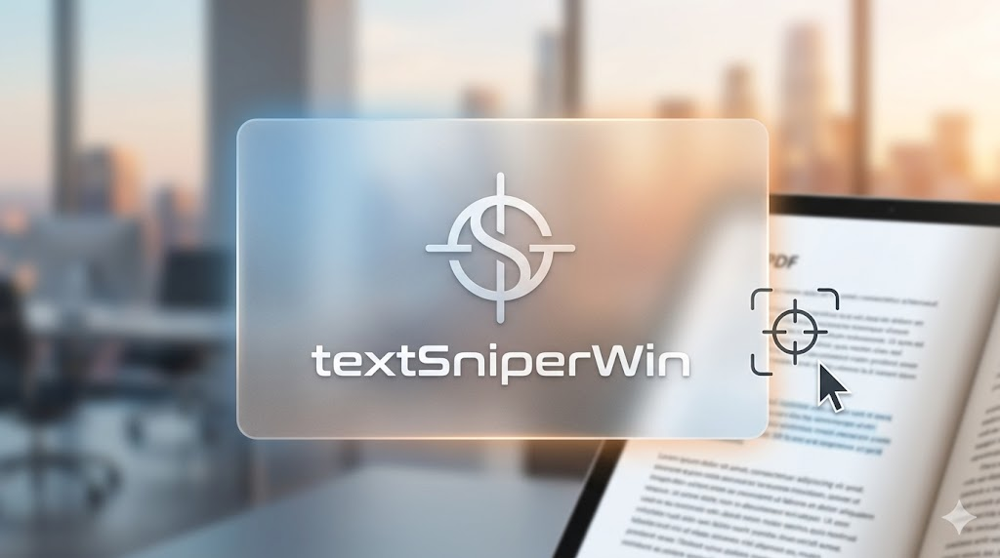

# TextSniper for Windows

화면의 특정 영역을 캡처하여 OCR로 텍스트를 인식하고 클립보드에 복사하는 경량 데스크톱 앱.

[](https://github.com/nicewook/textSniperWin/releases)



## 주요 기능

- **`Shift+Alt+T`** 단축키로 빠른 캡처
- Windows OCR API 활용 (영어 + 한국어)
- 시스템 트레이 상주, 자동 실행 지원

## 설치

1. [Releases](https://github.com/nicewook/textSniperWin/releases)에서 `TextSniper_x.x.x_x64-setup.exe` 다운로드
2. 실행하여 설치
3. 시스템 트레이에서 TextSniper 아이콘 확인
4. `Shift+Alt+T`로 캡처 시작

## 시스템 요구사항

- Windows 10 버전 1903 이상
- 한국어 OCR 사용 시 Windows 한국어 언어팩 필요

## 기술 스택

- Rust + Tauri v2
- Win32 API 오버레이 (`WS_EX_LAYERED`)
- Windows OCR API (`Windows.Media.Ocr`)
- GDI BitBlt 화면 캡처

## 빌드

```bash
cd src-tauri && npx @tauri-apps/cli build
```

## 라이선스

MIT
